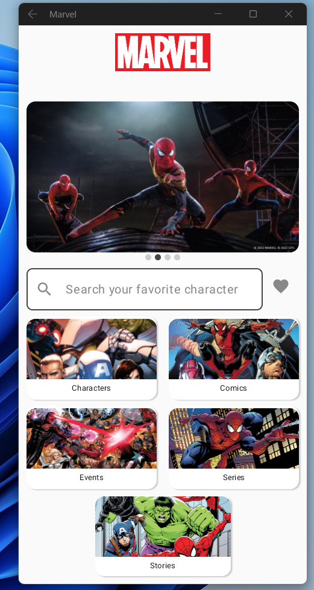
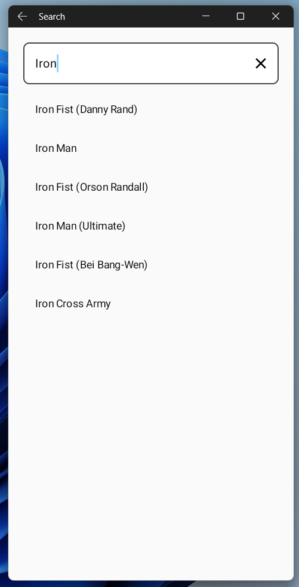
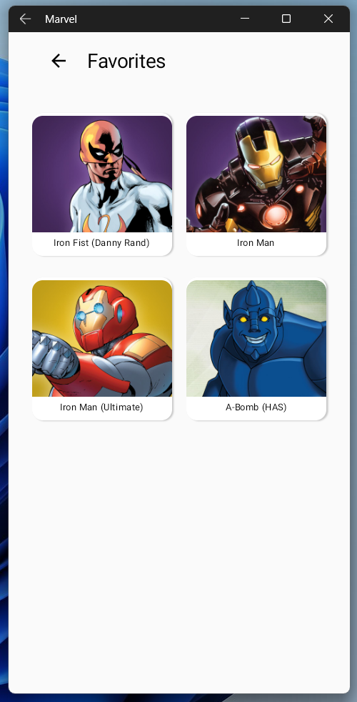
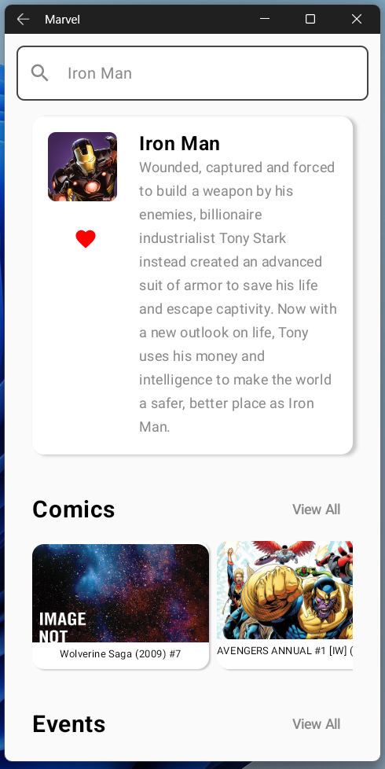

# Marvel App

Marvel App is an Android application that allows you to search for Marvel content and view detailed information about them.

### Tech Stack

To build this app, the following technologies and architecture were used:

- **MVVM (Model-View-ViewModel)**: For managing UI-related data in a lifecycle-conscious way.
- **Retrofit**: For handling all networking tasks, including API calls to fetch data from the Marvel API.
- **Room Database**: To cache search results locally, ensuring that users can view previously searched characters even when offline.
- **Clean Architecture**: The app's architecture follows clean architecture principles to separate concerns and improve code maintainability.
- **SOLID Principles**: The codebase is designed with SOLID principles in mind, ensuring that the app is scalable and easy to modify.

### Showcase

Here are some screenshots of the end product application, however you can also watch the demo in this [video](https://drive.google.com/file/d/1N0nepfk3L3-INClcMGb4xYb0ComuIH2C/view?usp=drive_link).

### Data

All data is fetched from the [Marvel API](https://developer.marvel.com/). The app retrieves information about Marvel characters and displays it to the user in a clean and user-friendly manner.

### How to Run the Project

-Clone the repository from GitHub:
   git clone https://github.com/ahmeddyounes/Marvel.git

-Open the project in Android Studio.

-Edit the Api Keys in AppConfig.kt file

-Build and run the project on an emulator or physical device.

### Key Features
**Search for Marvel Characters:** The app allows users to search for their favorite Marvel characters by name.

**View Character Details:** Detailed information about each character is displayed, including their description, comics, series, and more.

**Offline Support:** If the user is disconnected from the internet, the app can display cached results from previous searches.

### Code Structure
The project follows a clean architecture approach, with the following layers:

**Domain Layer:** Contains the business logic of the application.

**Data Layer:** Responsible for data handling, including API calls and database management.

**Presentation Layer:** Manages the UI components and communicates with the ViewModel to display data.

### Contributing
If you would like to contribute to this project, please fork the repository and submit a pull request with your changes.

